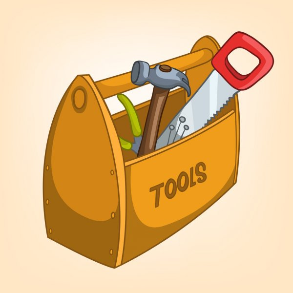

# Rapport d'alternance

Auteur : <strong>David Cornacchia</strong> 
Période : <strong>Octobre 2020 - Décembre 2021</strong> 
Dernière mise à jour : <strong>03/12/2021</strong>

# Sommaire

1. **Contexte**
   * Présentation

   * Greentic

   * Objectifs

2. **Problématiques**

   * Configurer un environement de développement

   * Développer une fonctionnalité dans une application éxistante

3. **Missions**

   * Organisation du travail

   * Méthodes de travail

   * Présentation d'une mission

4. **Bilan**

   * Ce que j'ai appris

   * Ce que j'ai mis en pratique

   * Ce que j'ai apporté 

# Contexte

 

## Présentation
Je m'appelle David Cornacchia, je suis actuellement le parcours de formation **Développeur d'application PHP Symfony** en alternance. 

J'ai commencé mon processus de reconversion professionnelle en 2018 en commençant par diverses formations courtes en ligne afin de m'initier au développement web, puis j'ai suivi le parcours OpenClassroom **Prep'fullstack**.

A l'issue de ce parcours j'ai trouvé un emploi de développeur back-end Junior au sein de la société Greentic qui tend à s'orienter de plus en plus vers des projets utilisant le framework **Symfony**. 

Mon désir de perfectionner mes compétences coïncidant avec la stragtégie d'évolution de la société, nous avons donc décidé de m'inscrire à ce parcours en alternance. 

 

## Greentic
Créée en 2007, **Greentic** est une agence web située à Lyon. 

Elle est composée actuellement de 4 personnes. Parmis les prestations proposées par Greentic, les **solutions e-commerce** sous Prestashop représente une des plus importante.

En tant que développeur **PHP/Symfony**, mon travail consistait principalement au développement de modules pour le CMS **Prestashop** qui est basé sur le Framework Symfony. 

  

## Les objectifs

### **Technique**

L'un des objectifs de cette alternance était de pouvoir en paralèlle de ma formation, pouvoir mettre en pratique et perfectionner les compétences acquises dans le cadre de ma formation _( PHP, Symfony, conception, versionning, etc...)_ .

### **Organisation**

L'immersion en milieu professionnel m'a permise également de me familiariser avec les méthodes et l'**organisation du travail** au sein d'une agence web, comme par exemple :
- la **répartition des tâches** en fonction des priorités et d'une **estimation de temps** 
- l'organisation d'une **mise en production** d'une application web.

# Problématiques

 
Au cours de cette alternance j'ai été amené à devoir apporter une solution à plusieurs problématiques. 
Parmis celles-ci, 

## **Comment intégrer une nouvelle fonctionnalité à une application existante ?**

Le développement de modules pour le CMS **Prestashop** composant la majeure partie de mes missions, je devais donc pour chacune d'elles, concevoir une solution qui permettrait d'intégrer une ou plusieurs nouvelles fonctionnalités, tout en veillant à ne pas perturber le **fonctionnement** ou la **maintenabilité** du reste de l'application.

Il est donc nécessaire d'avoir une bonne **connaissance de la structure de l'application** afin d'orienter son développement de manière à respecter au maximum l'architecture de celle-ci pour l'implémentation de nouvelles fonctionnalités.

## **Comment configurer efficacement un environement de développement ?**

Dans le cadre de mon alternance j'ai été amené à travailler sur des applications web déjà existantes et utilisant des technologies plus ou moins récentes. 

Il était donc nécessaire à chaque fois, de pouvoir reproduire un **environement de développement** local le plus fidèle possible à l'**environement de production** (version PHP, MySql, Composer, NodeJs, etc...). 

# Missions

 

## Organisation du travail

### **Attribution des tâches à effectuer**
Comme dans beaucoup d'agences, les tâches sont réparties sous formes de **tickets** qui sont attribués à un ou plusieurs développeurs.

Pour la gestion de ces **tickets**, nous utilisons l'outil `Wrike`. Le développeur peut avec cet outil consulter la liste des tickets qui lui ont été attribués.

   

<!--   -->

### **Détail d'un ticket**
Chacun de ces **tickets** contient un certain nombre d'informations sur le travail à effectuer :
- _Titre_
- _Client/Projet_
- _Description_
- _Dates de début et de fin estimée_
- _Estimation du temps nécessaire_
- _Personnes à qui ce ticket a été attribué_
- _etc..._

   

 

## Différentes technologies

On peut distinguer les tâches qui m'ont été confiés par les technologies utilisées.

- La création/upgrade de modules __`Prestashop`__
- Développement de __`Scripts PHP`__ _(architecture fonctionnelle)_
- Développement d'applications __`Symfony/Sylius`__
- Création/upgrade de modules __`Wordpress`__

   

 

## Présentation d'une mission

L'une des plus importantes missions sur laquelle j'ai pu travailler est la conception d'un module de **marketplace** pour Prestashop.

### **Description**

Comme son nom l'indique ce module a pour rôle de créer une place de marché sur laquelle les utilisateurs peuvent proposer leurs propres produits.

Le module se décompose en 3 parties :
- Un menu de configuration du module dans le Back-Office natif du CMS
- Un espace d'administration destiné aux vendeurs ( _CRM_ )
- Des fonctionnalités supplémentaires destinées à l'interactions entre les clients et les vendeurs ( _messagerie, avis, etc..._ ).

### **Gestion de projet**

A partir du cahier des charges le projet a été découpé en plusieurs tickets. 

Pour la plupart, ces tickets correspondaient aux différentes sections des menus de configuration ou à une fonctionnalité spécifique _( ex: page de gestion des transporteurs, affichage du nom du fournisseur sur la page produit )_.

Une fois le développement de la branche terminée, elle est fusionnée à la branche principale après avoir été validée par le responsable du projet _(review de code et tests manuels)_.

### **Fonctionnalités développées**

Au cours des 9 mois de développement de ce module, les fonctionnalités sur lesquelles j'ai été amené à travailler m'ont permise d'acquérir ou de perfectionner un certain nombre de compétences :

| Contexte                                  | Compétence                                                                                                                             |
| ----------------------------------------- | -------------------------------------------------------------------------------------------------------------------------------------- |
| Développement d'un module                 | **Analyse** du fonctionnement d’une application/structure existante                                                                    |
| Profil fournisseur                        | Génération dynamique de fichier **PDF**                                                                                                |
| Tableau de bord                           | Génération de **graphiques** à partir de statistiques de vente                                                                         |
| Messages personnalisés                    | Traitement de données HTML fournis par le revendeur _(**TinyMCE**)_                                                                    |
| Import de produits                        | Traitement/Import/Export de fichiers sous différents formats:  **JSON**, **CSV**, **XML**, **image** en PHP                            |
| Pré-inscription                           | Pré-inscription d'un utilisateur; process de validation par token                                                                      |
| Messagerie                                | Système de messagerie : **interfaces** fournisseur & client , affichage par conversation, pagination, gestion de pièces jointes etc... |
| Gestion des rôles utilisateur             | Traitement de formulaire en **AJAX**                                                                                                   |
| Navigation à facettes (page fournisseurs) | Filtres configurables, chargement du contenu asyncrone                                                                                 |
| Souscription                              | Script php : vérification de la validité de l'abonnement _(**cron task**)_                                                             |

# Bilan

 

A l'issue de mon parcours de formation, je suis en mesure de fournir une analyse sur les différentes compétences que j'ai pu acquérir ou perfectionner durant cette période.

## **Ce que j'ai appris dans le cadre de mon travail**
L'une des problématiques auquelles cette période d'alternance a répondu etait: *Comment intégrer une nouvelle fonctionnalitée a une applicationexistante ?*  
Le développement de modules pour le CMS Prestashop à été l'occasion de travailler dans un contexte de contraintes techniques très poussé.  
En effet, la structure du CMS Prestashop présente souvent une **structure complètement** différente d'une version à une autre. 
Cela à donc été pour moi, l'occasion d'apprendre à **analyser et comprendre** le fonctionnement de chacune des structures sur lesquelles j'ai travaillé.

- **Traduire les besoins/demandes d'un client en fonctionnalités**  
Mon responsable étant le principale interlocuteur des clients, la traduction des besoins en fonctionnalités est en grande partie faite avant que la tâche soit confiée au développeur.  
J'ai donc eu beaucoup l'occasion d'assister a ce processus de conception et parfois même, de participer au perfectionnement.

- **Savoir comprendre le fonctionnement d’une application/structure existante**
Mon travail consitant principalement au développement de **modules** pour Prestashop, il est donc nécessaire d'accorder au préalable une attention particulière au **fonctionnement de la structure** du CMS. 
J'ai donc pu améliorer ma capacité à **comprendre** et **analyser** le fonctionnement d'application et ainsi de mieux en mieux être capable de visualiser la meilleure façon d'implémenter une ou plusieurs nouvelles fonctionnalités.

- **S'adapter à un contexte technique**

Il m'est très souvent arrivé de devoir développer sur des anciennes version de Prestashop( _1.5_ et _1.6_) Cela m'a donc permis de me familiariser avec des anciennes version de 

  - S'adapter à un contexte technique (version PHP, Prestashop, APIs, etc...)
### **Gérer le versionning d'un projet**

  - Gérer le versionning d'un projet (GIT)

### **Se familiariser avec l'utilisation de requêtes AJAX**
  - Se familiariser avec l'utilisation de requetes AJAX (front & back)

### **Interagir avec défférents types de données**
  - Interagir avec différents types de données (_.xml, .csv, .json, etc..._) et technologies ( _API, CRM, flux, etc..._ )

## **Ce que j'ai mis en pratique**

### Conceptualiser une application
### Rédiger les spécifications détaillées d'un projet**

  - Rédiger les spécifications détaillées d'un projet
  - Conceptualiser une application complète en décrivant sa structure

  - Respecter les bonnes pratiques de développement en vigueur
  - Développement/consomation API
  - Mettre en place des tests unitaires et fonctionnels

## **Ce que j'ai apporté**
  - Savoir paramètrer un environement de développement (Docker)

